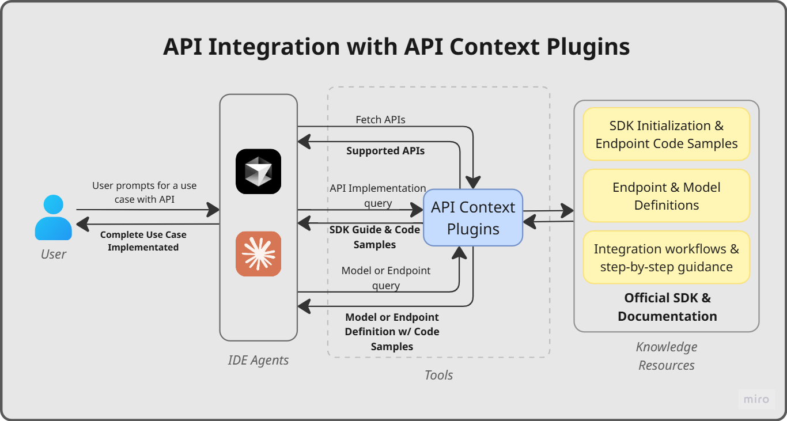

# APIMatic ContextMatic

**SDK-native API context, delivered directly into your AI coding agent.**

[](https://www.apimatic.io/product/context-plugins)
[](#cursor-install)
[](#claude-code-install)
[](#vs-code-install)

---

## What is ContextMatic?

Coding agents hallucinate APIs. APIMatic Context gives them curated, versioned API and SDK docs.

When a developer asks their agent to "integrate the payments API," it normally guesses, pulling from outdated training data or generic patterns that don't match the actual SDK. ContextMatic solves this by giving the agent authoritative, version-aware, SDK-native context at the exact moment it's needed.

---

## Try It Now

Install ContextMatic in your coding agent:

<a id="cursor-install"></a>
<details>
<summary><strong>Cursor</strong></summary>

> *Prerequisite: Cursor v2.6.14 or higher is required for ContextMatic*

1. Install the MCP server with this one-click.
   
[](https://cursor.com/en-US/install-mcp?name=context-matic&config=eyJ0eXBlIjoiaHR0cCIsInVybCI6Imh0dHBzOi8vY2hhdGJvdGFwaS5hcGltYXRpYy5pby9tY3AvcGx1Z2lucyIsImhlYWRlcnMiOnsiWC1BcGltYXRpYy1NY3AtQ2xpZW50IjoiQ3Vyc29yIn19)

This Cursor deeplink embeds the Cursor-specific MCP configuration directly and adds the MCP server only. 

2. Ask your agent to install the bundled skills from these files:

- [plugins/context-matic/skills/integrate-context-matic/SKILL.md](plugins/context-matic/skills/integrate-context-matic/SKILL.md)
- [plugins/context-matic/skills/onboard-context-matic/SKILL.md](plugins/context-matic/skills/onboard-context-matic/SKILL.md)

Use prompts like these:

```text
/create-skill [paste skills/integrate-context-matic/SKILL.md here]
```

```text
/create-skill [paste skills/onboard-context-matic/SKILL.md here]
```

3. Ensure the `context-matic` MCP server is enabled by `Ctrl+Shift+P` > `>View: Open MCP Settings` > `context-matic` > enable

</details>

<a id="claude-code-install"></a>
<details>
<summary><strong>Claude Code</strong></summary>

> *Prerequisite: Claude Code v2.1.92 or higher is required for ContextMatic*

> *Note: Publishing to the [Claude plugins Marketplace](https://claude.com/plugins) is in progress.*

Install in Claude Code with these commands:

1. Add this repository as a marketplace:

```text
/plugin marketplace add apimatic/plugin-marketplace
```

2. Install the plugin:

```text
/plugin install context-matic@apimatic
```
If prompted, choose `Install for you (user scope).`.

3. Reload plugins:

```text
/reload-plugins
```

4. View all installed MCP Servers:

```text
/mcp
```

5. Ensure the context-matic MCP Server is enabled by selecting context-matic in the returned list.

</details>

<a id="vs-code-install"></a>
<details>
<summary><strong>VS Code</strong></summary>

> *Prerequisite: Visual Studio Code v1.114.0 or higher is required for ContextMatic*

Install it directly in VS Code from the Awesome Copilot Marketplace:

1. Open the Extensions view with `Ctrl+Shift+X`.
2. Search for the plugin with:

```text
@agentPlugins context-matic
```

3. Select ContextMatic and click **Install**.
4. Ensure the bundled `context-matic` MCP server is enabled by `Ctrl+Shift+P` > `>MCP: List Servers` > `context-matic` > enable

</details>

After installing, use the **`/onboard-context-matic`** skill to get an interactive guided tour. The agent will explain the four MCP tools, show you all available APIs, let you pick one to explore, and demonstrate live lookups with runnable code samples:

```
/onboard-context-matic
```
---

## ACP PayPal Plugin

The marketplace also ships **`acp-paypal`** — a PayPal-focused plugin built on the same SDK-native context engine. It adds the `acp-paypal-server-sdk-cs` MCP server, an `/integrate-paypal` skill, and two specialized subagents:

- **`paypal-plan`** — a read-only planner that produces a precise, SDK-contract-grounded PayPal integration plan (endpoints, models, auth) before any code is written.
- **`paypal-debug`** — diagnoses and fixes PayPal API issues in your project, verifying every change against the MCP server.

Install it alongside (or instead of) ContextMatic:

<details>
<summary><strong>Cursor</strong></summary>

1. Install the MCP server and add this repository as a marketplace, then install the plugin:

```text
/plugin marketplace add apimatic/plugin-marketplace
```

2. Install the `acp-paypal` plugin from the marketplace, or add the MCP server manually via `Ctrl+Shift+P` > `>View: Open MCP Settings`.
3. Ensure the `acp-paypal-server-sdk-cs` MCP server is enabled.

</details>

<details>
<summary><strong>Claude Code</strong></summary>

1. Add this repository as a marketplace:

```text
/plugin marketplace add apimatic/plugin-marketplace
```

2. Install the plugin:

```text
/plugin install acp-paypal@apimatic
```
If prompted, choose `Install for you (user scope).`.

3. Reload plugins:

```text
/reload-plugins
```

4. Confirm the `acp-paypal-server-sdk-cs` MCP server is connected:

```text
/mcp
```

</details>

<details>
<summary><strong>VS Code</strong></summary>

1. Open the Extensions view with `Ctrl+Shift+X`.
2. Search for the plugin with:

```text
@agentPlugins acp-paypal
```

3. Select ACP PayPal and click **Install**.
4. Ensure the bundled `acp-paypal-server-sdk-cs` MCP server is enabled by `Ctrl+Shift+P` > `>MCP: List Servers` > `acp-paypal-server-sdk-cs` > enable

</details>

Once installed, use the `/integrate-paypal` skill (or just describe a PayPal task or error) to route work to the `paypal-plan` and `paypal-debug` agents:

```
/integrate-paypal Add PayPal order creation and capture to my ASP.NET Core checkout.
```

---

## Supported APIs

The plugin gives the agent SDK-native context for the following APIs, available in TypeScript, C#, Python, Java, PHP, and Ruby:

| API | Description |
|-----|-------------|
| **Adyen API** | Payment processing: retrieve payment methods, create orders, manage stored payment tokens |
| **Google Maps APIs** | Location services: geocoding, directions, distance matrix, elevation, roads, and places |
| **PayPal Server SDK** | Payment flows: orders, payments, vault, transaction search, and subscriptions |
| **PayQuicker API** | Payment and financial services: program agreements, bank accounts, spendback quotes |
| **Slack API** | Workspace automation: OAuth bots, messaging, conversation management |
| **Spotify Web API** | Music and podcasts: library management, playback control, discovery |
| **Tesla Fleet Management API** | Vehicle and fleet operations: charging history, vehicle commands, energy management |
| **Tesser API Portal** | Digital payments: payment intents, onchain payments, app management |
| **Twilio API** | Communications: SMS, voice, video, and verification services |

This list is growing. [Suggest a new API](#contributing) to request support for one not listed here.

---

## What the Plugin Gives the Agent

Once installed, the plugin exposes four tools to the agent. Each tool is mapped to a specific stage of the integration workflow:

| Tool | Developer task it enables |
|------|--------------------------|
| `fetch_api` | Provide an exact api match or lists all available APIs with their name, key, and description. Pass your project's language and an API name as `key` for an exact-match lookup (returns only that API). The full API catalog is returned if no exact match is found. The agent calls this first to discover which APIs are available. |
| `ask` | Chat with API Copilot for step-by-step integration guidance and general API questions: authentication setup, client initialization, feature behavior, framework-specific patterns (e.g. "How do I initialize the Twilio client in Laravel?"), and idiomatic SDK code samples. |
| `endpoint_search` | Returns an SDK endpoint method's description, input parameters, and response shape by method name. |
| `model_search` | Returns an SDK model's full definition and its typed properties by name. Call this before writing code that constructs request bodies or reads response objects. |

For step-by-step guidance on using these tools together, invoke the `/integrate-context-matic` skill in your agent. It tells the agent when and how to call each tool throughout your integration workflow.

---

## From Prompt to Code: How the Tools Work Together

The four tools are designed to chain together in a natural integration workflow. Here is a concrete example of what happens under the hood when the agent receives a real task:

**Your prompt:** _"/integrate-context-matic Add Twilio SMS notifications to my Next.js app. Send a text when an order ships."_

| Step | Tool called | What it returns |
|------|-------------|----------------|
| 1 | `fetch_api` (`language=typescript`, `key="twilio"`) | Exact match found — returns Twilio's entry with its name, key, and description |
| 2 | `ask` (`key=twilio`, query=_"How do I initialize the Twilio TypeScript client?"_) | Returns exact SDK setup code with auth configuration |
| 3 | `endpoint_search` (`query=createMessage`) | Returns the method signature, required parameters, and auth requirements for the SMS send endpoint |
| 4 | `model_search` (`query=CreateMessageRequest`) | Returns the full typed request model with every available field |
| 5 | `ask` (`query="How do I handle delivery status callbacks in Next.js?"`) | Returns webhook handling code aligned to the Twilio SDK |

Each step completes in a single tool call. The agent handles the orchestration. You describe the goal, and it picks the right tool at the right time.

---

## Build a Full App in Minutes

<details>
<summary><strong>PayPal Instant Storefront — Node.js/Express · 30 min</strong></summary>

   


**What was built:** A full Node.js/Express storefront with product management, shareable checkout links per product, PayPal Smart Payment Buttons, server-side order creation and capture, and a payment history dashboard.

**The prompt:**
  
```
/integrate-context-matic Build me a "PayPal Instant Storefront" app.
The app has a setup page where I enter my PayPal client-id and secret once, then
a product creation form where I enter a product name, description, price, currency,
and upload or provide product images. When I click "Generate Checkout Page" it
creates a live, shareable checkout URL like /checkout/abc123 that anyone can open —
they see the product details with images, price, description, and a working PayPal
Smart Payment Button. The payment flow should be fully server-side using the PayPal
Server SDK: backend creates the order when buyer clicks pay, captures it after
approval, and shows a confirmation page with order details. I should be able to
create multiple products and each gets its own unique checkout link I can share
with anyone. Include a simple dashboard where I can see all my products and their
checkout links, plus a list of completed payments showing order ID, buyer info,
amount, and status for each product. The checkout pages should be mobile-responsive
and look like real professional product pages. Support sandbox and live mode via
environment variables. Only use the Orders API and Payments API, do not use
Transaction Search or Vault. Make it deployable with npm install and npm start.
```

**How the tools were used:**

| Step | Tool | Query | What it returned |
|------|------|-------|-----------------|
| 1 | `fetch_api` | `language=typescript` | Available APIs; identified PayPal Server SDK with key `paypal` |
| 2 | `ask` | SDK setup & environment switching | Client initialization code, `.env` structure, sandbox vs. live config via `Client.fromEnvironment` |
| 3 | `ask` | Order creation flow | End-to-end create → approve → capture flow with full TypeScript server-side code |
| 4 | `endpoint_search` | `ordersCreate` | `CreateOrder` method signature, `OrderRequest` body structure, response type `Order`, error codes |
| 5 | `endpoint_search` | `capture` | `CaptureOrder` contract — required `id` param, optional body, capture ID location in response |
| 6 | `model_search` | `OrderRequest` | Full request model properties; flagged `payer` and `application_context` as deprecated |
| 7 | `model_search` | `Money` | Currency code and value fields for structuring amounts |
| 8 | `ask` | Smart Payment Buttons | Frontend button integration — `createOrder` / `onApprove` wiring to backend endpoints |
| 9 | `endpoint_search` | `getOrder` | `GetOrder` method signature and response shape for the confirmation page |
| 10 | `model_search` | `PurchaseUnitRequest` | Full model with `amount`, `items`, `shipping`, and all optional fields |
| 11 | `model_search` | `Order` | Full response model — `status`, `purchaseUnits`, `links` (including the `approve` redirect URL) |

**App outcome:**

- One-time credential setup page with live sandbox validation
- Product creation with name, description, price, currency, and image upload
- Unique shareable checkout URL per product (`/checkout/abc123`)
- Server-side order creation and capture — no client secrets exposed
- Confirmation page with order ID, buyer info, and capture details
- Dashboard with all products, total revenue, and payment history
- Mobile-responsive checkout pages
- Deployable with `npm install && npm start`

**Build time:** 10 min generation + 20 min testing = **30 minutes total**

</details>

<details>
<summary><strong>Spotify Music DNA Card — Python/Flask · 30 min</strong></summary>

  


**What was built:** A Python/Flask web app where users authenticate via Spotify OAuth, fetch their top artists and tracks, retrieve audio features in batch, and analyze the data to produce a personalized "Music DNA" card — featuring a radar chart of average audio features, top 5 genres, most obscure artist, and a generated personality label — with a download/share button. Custom branding only; no Spotify logos.

**The prompt:**

```
/integrate-context-matic Create a web app using Python where users log in with Spotify,
fetch their top artists and top tracks, then fetch audio features for those tracks.
Analyze the data to calculate average audio features, find the most obscure artist,
determine the top 5 genres, and generate a "music personality" label based on the
averages. Render all of this in a visually appealing DNA card with a radar chart,
top genres, most obscure artist, and personality label, and include a button to
download or share the card. Use your own branding and logo; do not include Spotify
logos anywhere.
```

**How the tools were used:**

| Step | Tool | Query | What it returned |
|------|------|-------|-----------------|
| 1 | `fetch_api` | `language=python` | Available APIs; identified Spotify Web API SDK with key `spotify` |
| 2 | `ask` | SDK setup, OAuth 2.0 authorization code flow for user login | Full `pip install spotify-api-sdk` setup, `SpotifywebapiClient` initialization with `AuthorizationCodeAuthCredentials`, `.env` structure, `get_authorization_url()` → `fetch_token(code)` → `clone_with(o_auth_token=token)` flow, token refresh pattern |
| 3 | `ask` | How to fetch a user's top artists and top tracks | End-to-end code using `users_controller.get_users_top_artists()` and `users_controller.get_users_top_tracks()` with `time_range`, `limit`, `offset` params; reading `PagingArtistObject.items` and `PagingTrackObject.items` |
| 4 | `endpoint_search` | `get_users_top_artists` | Method signature — params `time_range`, `limit`, `offset`; response type `PagingArtistObject`; required scope `OAuthScopeEnum.USER_TOP_READ` |
| 5 | `endpoint_search` | `get_users_top_tracks` | Method signature — same params as top artists; response type `PagingTrackObject` with `List[TrackObject]` items |
| 6 | `endpoint_search` | `get_audio_features` | Single-track method via `tracks_controller.get_audio_features(id)`; response type `AudioFeaturesObject` |
| 7 | `endpoint_search` | `get_several_audio_features` | Batch method via `tracks_controller.get_several_audio_features(ids)` — takes comma-separated track IDs string; response type `ManyAudioFeatures` |
| 8 | `endpoint_search` | `get_current_users_profile` | `users_controller.get_current_users_profile()` — no params; response `PrivateUserObject`; required scopes `USER_READ_EMAIL`, `USER_READ_PRIVATE` |
| 9 | `model_search` | `AudioFeaturesObject` | All 14 properties — `danceability`, `energy`, `valence`, `acousticness`, `instrumentalness`, `liveness`, `speechiness`, `tempo`, `loudness`, `key`, `mode`, `time_signature`, `duration_ms`, `uri` (all 0.0–1.0 floats used for radar chart & personality logic) |
| 10 | `model_search` | `ArtistObject` | Properties `name`, `id`, `popularity` (0–100 int, used to find most obscure artist), `genres` (`List[str]`, used for top-5 genre aggregation), `images`, `external_urls` |
| 11 | `model_search` | `TrackObject` | Properties `id` (needed for audio features batch call), `name`, `popularity`, `artists` (`List[ArtistObject]`), `album`, `duration_ms`, `uri` |
| 12 | `model_search` | `PagingTrackObject` | Paging wrapper — `items` (`List[TrackObject]`), `total`, `next`, `offset`, `limit` |
| 13 | `model_search` | `ManyAudioFeatures` | Batch response wrapper — `audio_features` (`List[AudioFeaturesObject]`) for iterating and averaging |
| 14 | `model_search` | `PrivateUserObject` | User profile — `display_name`, `images` (`List[ImageObject]`), `id`, `email`, `country` (used to personalize the DNA card header) |

**App outcome:**

- Spotify OAuth 2.0 login via Authorization Code flow (no client secrets exposed to browser)
- Fetches current user's profile (`display_name`, avatar) to personalize the card
- Retrieves top 50 artists and top 50 tracks (configurable `time_range`: short/medium/long term)
- Batch-fetches audio features for all top tracks via `get_several_audio_features`
- Computes average audio features (danceability, energy, valence, acousticness, instrumentalness, liveness, speechiness) across all tracks
- Identifies the most obscure artist (lowest `popularity` score among top artists)
- Aggregates and ranks top 5 genres from all top artists' genre lists
- Generates a "music personality" label based on average feature thresholds (e.g., "Energetic Explorer", "Melancholic Dreamer", "Chill Acoustic Soul")
- Renders a visually appealing DNA card with:
  - Radar chart (Chart.js) of the 7 average audio features
  - Top 5 genres with visual badges
  - Most obscure artist with name and popularity score
  - Personality label prominently displayed
  - User's display name and avatar
- Download card as PNG and share button (html2canvas)
- Custom branding and logo throughout — no Spotify logos anywhere
- Token refresh handling for long sessions
- Deployable with `pip install -r requirements.txt && python app.py`

</details>

<details>
<summary><strong>Google Maps Restaurant Roulette — PHP · 30 min</strong></summary>

  


**What was built:** A PHP web app where users drop a pin (or use their location) on a Google Map, draw a travel-radius circle, and click "Spin" to randomly pick a restaurant within that radius. The app shows Google Places photos, a Street View storefront preview, and one-click directions — with a wheel animation and a "Spin Again" button for gamified suspense. Custom branding; credentials via `.env` file.

**The prompt:**

```
/integrate-context-matic Create a web application using php and google maps platform
apis sdk. for credentials create an env file in which the user will provide the API
Key. The user will Drop a pin (or use your location) on the map, draw a circle for
how far you are willing to travel, and click "spin." The app picks a random restaurant
within that radius, shows you photos from Google Places, a Street View preview of the
storefront, and one-click directions. Not happy with the pick? Spin again. The wheel
animation and suspense make it feel like a game.
```

**How the tools were used:**

| Step | Tool | Query | What it returned |
|------|------|-------|-----------------|
| 1 | `fetch_api` | `language=php` | Available APIs; identified Google Maps Platform SDK with key `googlemaps` (also: `paypal`, `spotify`, `maxio`, `verizon`) |
| 2 | `ask` | SDK setup, API key auth configuration | `composer require sdksio/google-maps-platform-sdk:1.0.3`, `GoogleMapsPlatformClientBuilder::init()` with `CustomQueryAuthenticationCredentialsBuilder::init('key')`, `.env` structure, `Environment::PRODUCTION` |
| 3 | `ask` | How to search for nearby restaurants within a radius | Full code using `$client->getPlacesApi()->nearbySearch($location, $radius, 'restaurant', ...)`, response handling via `isSuccess()` / `getResult()`, iterating `Place[]` results |
| 4 | `endpoint_search` | `nearbySearch` | Method signature — params `location` (`"lat,lng"`), `radius` (meters), `keyword`, `maxprice`, `minprice`, `opennow`, `pagetoken`, `rankby`, `type`, `language`; response type `PlacesNearbySearchResponse` |
| 5 | `endpoint_search` | `placeDetails` | Method signature — params `placeId`, `fields[]` (Basic/Contact/Atmosphere categories), `sessiontoken`, `language`, `region`; response type `PlacesDetailsResponse` |
| 6 | `endpoint_search` | `placePhoto` | Method signature — param `photoReference` (string), `maxheight`, `maxwidth` (1-1600px); response type `mixed` (raw image bytes) |
| 7 | `endpoint_search` | `streetView` | Method signature — params `size` (`"{w}x{h}"`, max 640px), `fov`, `heading`, `location`, `pitch`, `radius`, `source`; response type `mixed` (image bytes) |
| 8 | `endpoint_search` | `directions` | Method signature — params `destination`, `origin`, `mode`, `avoid`, `units`, `waypoints`, `language`, `region`; response type `DirectionsResponse` |
| 9 | `model_search` | `PlacesNearbySearchResponse` | Properties: `results` (`Place[]`), `status` (`PlacesSearchStatus`), `nextPageToken`, `errorMessage`, `htmlAttributions` |
| 10 | `model_search` | `PlacesDetailsResponse` | Properties: `result` (`Place`), `status` (`PlacesDetailsStatus`), `htmlAttributions`, `infoMessages` |
| 11 | `model_search` | `Place` | Full model — `name`, `placeId`, `formattedAddress`, `geometry` (`Geometry`), `rating`, `userRatingsTotal`, `priceLevel`, `photos` (`PlacePhoto[]`), `openingHours`, `types`, `vicinity`, `website`, `businessStatus`, `reviews` (`PlaceReview[]`) |
| 12 | `model_search` | `PlacePhoto` | Properties: `photoReference` (string, used for `placePhoto` call), `height`, `width`, `htmlAttributions` |
| 13 | `model_search` | `Geometry` | Properties: `location` (`LatLngLiteral`), `viewport` (`Bounds`) |
| 14 | `model_search` | `LatLngLiteral` | Properties: `lat` (float), `lng` (float) — used to extract coordinates for Street View and directions |
| 15 | `model_search` | `DirectionsResponse` | Properties: `routes` (`DirectionsRoute[]`), `status` (`DirectionsStatus`), `geocodedWaypoints`, `availableTravelModes`, `errorMessage` |
| 16 | `ask` | How to use Street View Static API for a given lat/lng | `$client->getStreetViewApi()->streetView($size, null, null, $location)`, returns raw image bytes; `streetViewMetadata()` for availability check |

**App outcome:**

- `.env` file with `GOOGLE_MAPS_API_KEY` for credentials
- Interactive Google Map with click-to-drop-pin or "Use My Location" (browser geolocation)
- Draggable circle overlay to set travel radius (meters)
- "Spin" button with wheel/slot-machine animation for suspense
- Backend `nearbySearch` with `keyword=restaurant` within the drawn radius
- Random restaurant selection from the `Place[]` results
- Place details card showing:
  - Restaurant name, rating, price level, and formatted address
  - Google Places photos carousel via `placePhoto` with `photoReference`
  - Street View storefront preview via `streetView` using the place's lat/lng
  - One-click directions link (Directions API or Google Maps URL with `origin` and `destination`)
- "Spin Again" button to re-roll without changing the pin/radius
- Pagination support via `nextPageToken` for more results
- Mobile-responsive map and card layout
- Deployable with `composer install && php -S localhost:8000`

</details>

---

## Example Prompts to Try

The best way to experience ContextMatic is to paste these prompts directly into Cursor, Claude Code, or VS Code after installing the plugin. Each prompt is written to naturally trigger the full tool chain.

<details>
<summary><strong>Quickstart: your first API call</strong></summary>

 
```
/integrate-context-matic Set up the Spotify TypeScript SDK and fetch my top 5 tracks.
Show me the complete client initialization and the API call.
```

---

 
```
/integrate-context-matic How do I authenticate with the Twilio API and send an SMS?
Give me the full PHP setup including the SDK client and the send call.
```

---

 
```
/integrate-context-matic Walk me through initializing the Slack API client
in a Python script and posting a message to a channel.
```

</details>

<details>
<summary><strong>Framework-specific integration</strong></summary>

  
```
/integrate-context-matic I'm building a Next.js app. Integrate the Google Maps
Places API to search for nearby restaurants and display them on a page.
Use the TypeScript SDK.
```

---

  
```
/integrate-context-matic I'm using Laravel. Show me how to send a Twilio SMS
when a user registers. Include the PHP SDK setup, client initialization, and the
controller code.
```

---

  
```
/integrate-context-matic I have an ASP.NET Core app. Add Twilio webhook handling
so I can receive delivery status callbacks when an SMS is sent.
```

</details>

<details>
<summary><strong>Chaining tools for full integrations</strong></summary>

These prompts are designed to exercise the full plugin workflow; from API discovery through endpoint lookup to production-ready code.

  
```
/integrate-context-matic I want to add real-time order shipping notifications
to my Next.js store. Use Twilio to send an SMS when the order status changes to
"shipped". Show me the full integration: SDK setup, the correct endpoint and its
parameters, and the TypeScript code.
```

---

  
```
/integrate-context-matic I need to post a Slack message every time a Spotify
track changes in my playlist monitoring app. Walk me through integrating both APIs
in TypeScript — start by discovering what's available, then show me the auth setup
and the exact API calls.
```

---

  
```
/integrate-context-matic In my ASP.NET Core app, I want to geocode user
addresses using Google Maps and cache the results. Look up the geocode endpoint
and response model, then generate the C# code including error handling.
```

</details>

<details>
<summary><strong>Debugging and error handling</strong></summary>

 
```
/integrate-context-matic My Spotify API call is returning 401. What OAuth flow
should I be using and how does the TypeScript SDK handle token refresh automatically?
```

---

 
```
/integrate-context-matic My Slack message posts are failing intermittently
with rate limit errors. How does the Python SDK expose rate limit information and
what's the recommended retry pattern?
```

</details>

---

## Measured Impact

Tested across four PayPal API integration tasks on two production-grade .NET applications — same task, same IDE (Cursor), same model (GPT-4.1 High), run with and without ContextMatic. Here's what changed:

| Metric | Agent only | Agent + ContextMatic | Change |
|--------|-----------|------------------------|--------|
| Compile / runtime errors | 16 | 1 | ↓ 91% |
| Prompt iterations | 34 | 16 | ↓ 54% |
| Token consumption | ~57M | ~20M | ↓ 65% |
| Manual fixes | 11 | 0 | ↓ 100% |
| Hallucinations | Multiple per run | 0 | ↓ ~Zero |

Code quality scores improved from an average of **~3.0 to ~4.8** across architecture, modularity, error handling, and readability.

→ [Read the full case study](https://www.apimatic.io/product/context-plugins/case-study)

---

## How APIMatic Generates context for an API



APIMatic takes your OpenAPI specification through the same SDK generation pipeline it uses to produce idiomatic, type-safe SDKs in 10+ languages. The resulting MCP server exposes the SDK documentation and integration patterns as structured tool responses that AI assistants can consume natively.

This means the context the AI receives is:
- Derived from actual generated SDK code, not raw documentation
- Inclusive of idiomatic patterns, typed models, and error handling
- Aligned to the current version of your API spec

For API providers: [request a demo](https://www.apimatic.io/request-demo) to generate context for your API.

---

## Repository Structure

This repository is a **multi-plugin marketplace** that targets Claude Code, Cursor, and VS Code. Each plugin carries one manifest per IDE, and each manifest points at its own MCP config file so it can send an IDE-specific telemetry header.

```
plugin-marketplace/
├── .claude-plugin/
│   └── marketplace.json          # Claude Code marketplace catalog (lists both plugins)
├── .cursor-plugin/
│   └── marketplace.json          # Cursor marketplace catalog (lists both plugins)
├── .github/
│   └── ISSUE_TEMPLATE/           # Issue templates for API, language, and feature requests
├── assets/                       # Shared logos and static assets used by the README
├── docs/
│   └── cross-platform-agents.md  # Authoring reference for cross-platform agent files
├── plugins/
│   ├── context-matic/            # MCP "context-matic" + integrate/onboard skills
│   │   ├── .claude-plugin/plugin.json   # Claude  → ./.claude-mcp.json
│   │   ├── .cursor-plugin/plugin.json   # Cursor  → ./.cursor-mcp.json (logo: assets/logo.svg)
│   │   ├── plugin.json                  # VS Code → ./.mcp.json
│   │   ├── .claude-mcp.json             # header X-Apimatic-Mcp-Client: ClaudeCode
│   │   ├── .cursor-mcp.json             # header X-Apimatic-Mcp-Client: Cursor
│   │   ├── .mcp.json                    # header X-Apimatic-Mcp-Client: VSCode
│   │   ├── assets/logo.svg
│   │   └── skills/
│   │       ├── integrate-context-matic/ # end-to-end API integration guidance
│   │       └── onboard-context-matic/   # interactive MCP onboarding tour
│   └── acp-paypal/               # MCP "acp-paypal-server-sdk-cs" + PayPal skill & agents
│       ├── .claude-plugin/plugin.json
│       ├── .cursor-plugin/plugin.json
│       ├── plugin.json
│       ├── .claude-mcp.json
│       ├── .cursor-mcp.json
│       ├── .mcp.json
│       ├── assets/logo.svg
│       ├── skills/integrate-paypal/     # PayPal integration guidance
│       └── agents/
│           ├── paypal-plan.md           # read-only PayPal API planner
│           └── paypal-debug.md          # diagnoses & fixes PayPal issues
├── CLAUDE.md
├── LICENSE.txt
└── README.md
```

---

## Contributing

Have a request or found an issue? Use one of the templates below:

- [Request a new language](../../issues/new?template=language-request.yml) — ask for support for a new SDK language (e.g., Swift, Kotlin, Rust)
- [Request a new API](../../issues/new?template=api-request.yml) — ask for a new third-party API to be added to the catalog
- [Report an issue or give feedback](../../issues/new?template=issue-feedback.yml) — report a bug, share feedback, or suggest an improvement to an existing tool

For anything else, [open a blank issue](../../issues/new) or reach out at [support@apimatic.io](mailto:support@apimatic.io).

---

## Learn More

- [Product page](https://www.apimatic.io/product/context-plugins)
- [Blog: From API Portals to Cursor](https://www.apimatic.io/blog/from-api-portals-to-cursor)
- [Case Study](https://www.apimatic.io/product/context-plugins/case-study)
